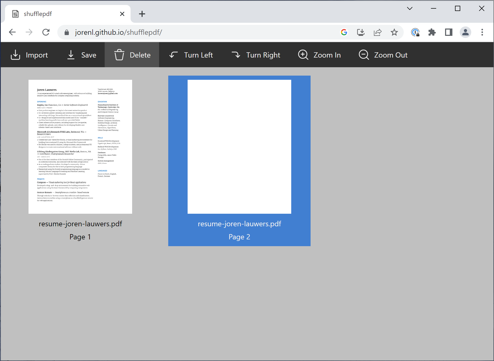

# shufflepdf

_Shufflepdf_ is a simple webapp to merge, split, rearrange or rotate PDF documents. [Try it here.](https://jorenl.github.io/shufflepdf/)

It runs in any modern browser, and can be installed as a PWA. All code runs locally and there is no server-side functionality, so all your documents remain private.

It is heavily inspired by [PDF Arranger](https://github.com/pdfarranger/pdfarranger) and its origin [PDF-Shuffler](http://sourceforge.net/projects/pdfshuffler), which I have used for years as my go-to pdf editing tools.

Shufflepdf is a work in progress, and is missing many of the features PDF Arranger supports.
